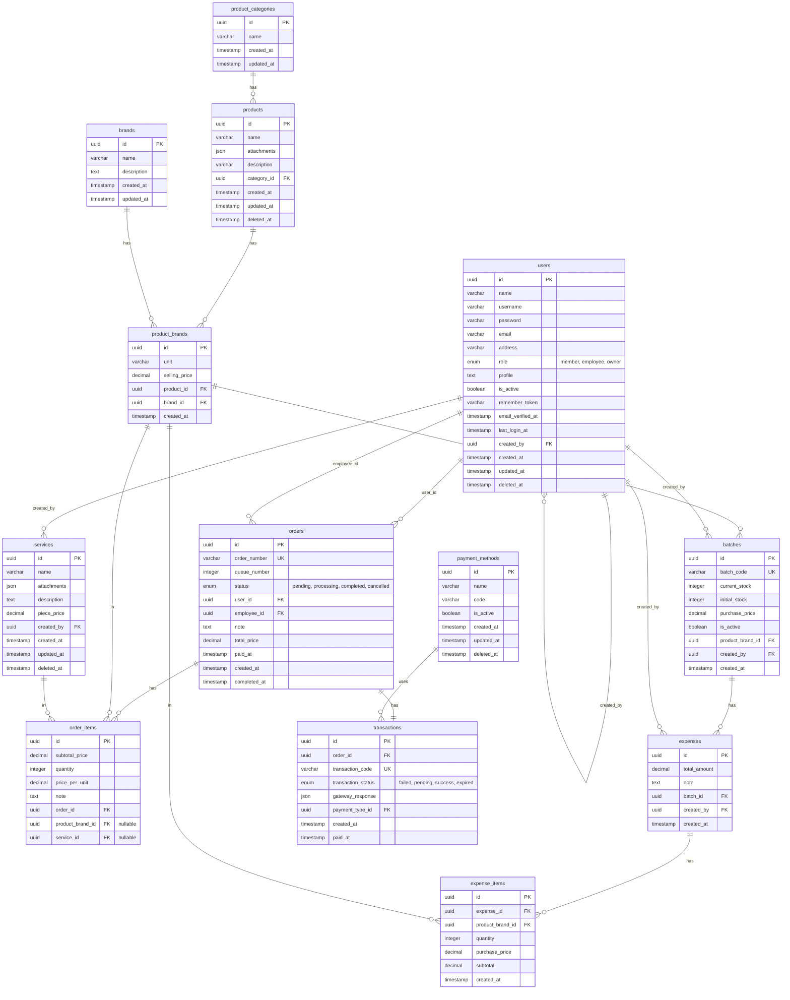

# E-Business Database Schema Documentation

This document outlines the database schema for the E-Business application. The schema uses `UUID` as the primary key for all tables.

## Entity Relationship Diagram

## Tables Details

### 1. `users`
Tabel untuk menyimpan data pengguna aplikasi.
- **id**: (UUID, PK) Identifier unik
- **name, username, password, email, address, profile**: Data diri.
- **role**: Enum ('member', 'employee', 'owner')
- **is_active**: Boolean untuk flag status aktif atau tidak.
- **created_by**: (UUID, FK) Referensi ke user lain (seperti admin) yang membuat user ini.
- Dilengkapi dengan *Soft Deletes* (`deleted_at`).

### 2. `brands`
Tabel untuk menyimpan master data brand/merk dari suatu produk.
- **id**: (UUID, PK)
- **name, description**: Info brand.

### 3. `product_categories`
Tabel untuk menyimpan data kategori dari produk.
- **id**: (UUID, PK)
- **name**: Nama Kategori.

### 4. `products`
Tabel master data produk yang merujuk pada kategori tertentu.
- **id**: (UUID, PK)
- **category_id**: (UUID, FK) Referensi ke `product_categories.id`.
- **attachments**: Format JSON untuk menyimpan data array gambar atau file produk.
- Dilengkapi *Soft Deletes*.

### 5. `product_brands`
Tabel pivot/relasi yang mengaitkan `products` dengan `brands`, serta menyimpan informasi spesifik harga dan satuan jual per merk.
- **id**: (UUID, PK)
- **product_id**: (UUID, FK)
- **brand_id**: (UUID, FK)
- **unit**: String untuk satuan produk (contoh: Pcs, Kg).
- **selling_price**: Harga jual (`decimal`).

### 6. `batches`
Tabel untuk mengelola stok/batch (penerimaan barang).
- **id**: (UUID, PK)
- **batch_code**: Kode unik batch.
- **current_stock, initial_stock**: Stok yang masuk dan sisa.
- **purchase_price**: Harga modal/beli.
- **product_brand_id**: (UUID, FK) Produk merk apa yang masuk dalam batch ini.
- **created_by**: (UUID, FK) User/Employee yang mengurus batch ini.

### 7. `orders`
Tabel pesanan.
- **id**: (UUID, PK)
- **status**: Enum ('pending', 'processing', 'completed', 'cancelled').
- **user_id**: (UUID, FK) Pelanggan.
- **employee_id**: (UUID, FK) Pegawai yang melayani pesanan.

### 8. `services`
Tabel untuk menyimpan data jasa (selain produk fisik).
- **id**: (UUID, PK)
- **name, description, piece_price**: Informasi jasa.
- **attachments**: Format JSON.
- **created_by**: (UUID, FK) User yang membuat data layanan.

### 9. `order_items`
Tabel detil pesanan (isi keranjang). Dapat berisi produk atau jasa.
- **id**: (UUID, PK)
- **order_id**: (UUID, FK)
- **product_brand_id**: (UUID, FK, Nullable) Terisi jika item merupakan produk.
- **service_id**: (UUID, FK, Nullable) Terisi jika item merupakan jasa.

### 10. `expenses`
Tabel pengeluaran operasional.
- **id**: (UUID, PK)
- **batch_id**: (UUID, FK) Mengaitkan pengeluaran terhadap batch tertentu (opsional/jika pengeluaran terkait pembelian batch).
- **created_by**: (UUID, FK)

### 11. `expense_items`
Tabel detil dari `expenses`.
- **id**: (UUID, PK)
- **expense_id**: (UUID, FK)
- **product_brand_id**: (UUID, FK) Barang yang dibeli dalam pengeluaran.

### 12. `payment_methods`
Tabel master data metode pembayaran.
- **id**: (UUID, PK)
- **name, code**: Detail metode pembayaran.
- **is_active**: Status bisa digunakan atau tidak.

### 13. `transactions`
Tabel transaksi pembayaran dari suatu Order.
- **id**: (UUID, PK)
- **order_id**: (UUID, FK, Unique) Relasi One-to-One dengan pesanan.
- **payment_type_id**: (UUID, FK) Mengacu ke tabel `payment_methods`.
- **transaction_status**: Enum ('failed', 'pending', 'success', 'expired').
- **gateway_response**: (JSON) Response raw dari payment gateway jika menggunakan sistem eksternal.

